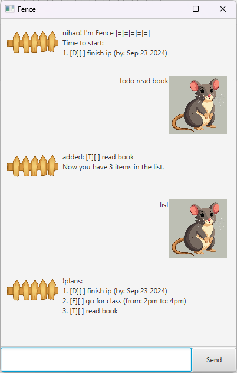

# Fence User Guide

Fence is a **chatbot for managing tasks, mainly for use via a Command Line Interface** (CLI) while still having the
benefits of a Graphical User Interface (GUI). If you can type fast, Fence can manage your tasks faster than traditional
GUI apps.

## Features

## Adding todos: `todo`

Adds a todo task to the chatbot.

Format: `todo TASK`

Examples: 
- `todo return book`

## Adding deadlines: `deadline`

Adds a deadline task to the chatbot.

> [!NOTE]  
> Fence automatically displays a reminder upon launch for deadline tasks on the due date.

Format: `deadline TASK /by YYYY-MM-DD`

Examples: 
- `deadline finish ip /by 2024-09-23`

## Adding events: `event`

Adds an event task to the chatbot.

Format: `event TASK /from START /to END`

Examples: 
- `event attend tutorial /from 2pm /to 4pm`

## Listing all tasks: `list`

Shows a list of all tasks in the chatbot.

Format: `list`

## Marking a task: `mark`

Marks the specified task as done.

Format: `mark INDEX`
- Marks a task at the specified `INDEX`
- The index refers to the index number shown in the displayed tasks list.
- The index **must be a positive integer** 1, 2, 3, ...

Examples: 
- `mark 1` Marks the first task in the task list as complete.

## Unmarking a task: `unmark`

Marks the specified task as undone.

Format: `unmark INDEX`
- Unmarks a task at the specified `INDEX`
- The index refers to the index number shown in the displayed tasks list.
- The index **must be a positive integer** 1, 2, 3, ...

Examples: 
- `unmark 2` Marks the second task in the task list as incomplete.

## Deleting a task: `delete`

Deletes the specified task from the chatbot.

Format: `delete INDEX`
- Deletes a task at the specified `INDEX`
- The index refers to the index number shown in the displayed tasks list.
- The index **must be a positive integer** 1, 2, 3, ...

Examples: 
- `delete 3` Deletes the third task in the task list. 

## Locating a task by description: `find`

Finds tasks whose description contain the given keywords.

Format: `find KEYWORD`
- Partial words can be matched e.g. `finish` will match `finish ip`
- The keyword must match the order in the task exactly e.g. `book return` will not match `return book`
- The keyword must match the formatting in the task exactly e.g. `tUtoRIal` will not match `attend tutorial`
- Only the description is searched.

Examples: 
- `find finish` returns `finish ip` and `finish homework`

## Exiting the program: `bye`

Input anything as the next message to exit the program.

Format: `bye`
